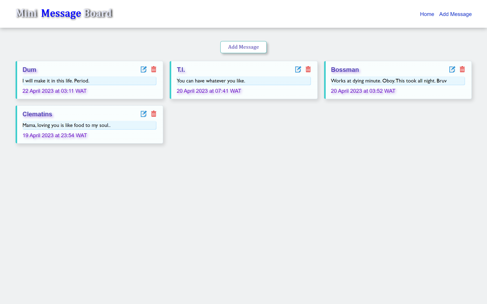
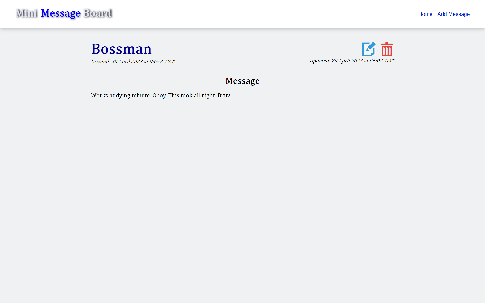
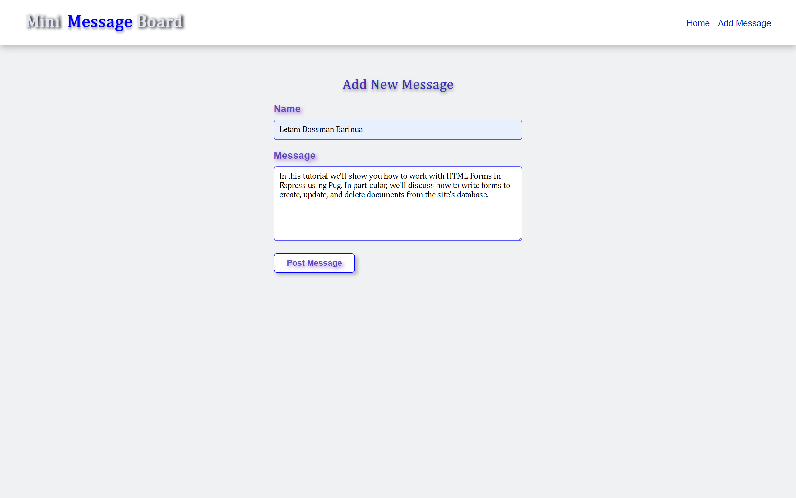

# Mini Message Board

## Introduction

The Mini Message Board project is a full-stack web application that allows users to perform CRUD operations on messages posted on a message board. The project demonstrates the use of NodeJS, ExpressJS, MongoDB, and Pug templating language. TypeScript is also used to provide a statically typed and structured codebase, enhancing the project's maintainability and scalability.

#### Index Page



#### Details Page



#### Create Page



## Learning Objectives

Throughout the development of this project, several learning objectives were achieved, including:

- Dynamic Routing: I learned how to create dynamic routing using route parameters, making it possible to handle different requests and display the appropriate responses.

- Serving Static Files: I learned how to serve static CSS files and images dynamically to different view engines, providing a more user-friendly interface.

- MVC Pattern: I structured the project using the MVC pattern, separating concerns into different modules to make the code easier to read, understand, and maintain.

- CRUD Operations: I learned how to perform CRUD operations using Mongoose to create schemas, models and interact with MongoDB, allowing for the efficient management of messages on the message board.

- Schemas And Models: I learned how to create models using TypeScript and handle date formatting with the Luxon library, making the code more organized and easy to maintain. Also leanred how to create virtual properties from existing properties in schema.

## Installation Instructions

Before proceeding with the installation, ensure that you have set up your MongoDB Atlas account and obtained the connection string, or have MongoDB Compass installed on your local machine. Mongoose requires a connection to a MongoDB database, and this setup is crucial for the proper functioning of the application.

To set up Express Local Library on your local machine, follow the steps below:

1. Clone the project: You can either download the project as a zip file and extract it, or use the terminal to clone the project using the following command:

```bash
git clone https://github.com/IAmYoungbossy/mini-message-board.git
```

2. Install dependencies: Navigate to the project directory in your text editor or terminal and install all the dependencies used in this project by running the following command:

```bash
npm install
```

3. Build TypeScript files: After successfully installing all the dependencies, run the following command to compile all the TypeScript files into JavaScript files in the /dist folder, which will be used in the production environment:

```bash
npm run build
```

4. Set up development environment: To set up a development environment, run the following command to enable watch mode using the nodemon module, which will automatically restart the web server whenever there's a change in the code:

```bash
npm run dev
```

5. Run in production environment: To run the project in a production environment, use the following command:

```bash
npm run start
```

## Additional Benefits

- TypeScript enhances code quality and reduces the likelihood of runtime errors by providing a statically typed codebase that catches type-related issues at compile time.

- Separating the code into different modules using the MVC pattern makes it easier to test individual components and maintain the codebase over time.

- Pug templating language simplifies the process of generating HTML code by providing a cleaner syntax and eliminating repetitive code.

## Things To Do

- Connect to MongoDb Atlas and deploy the App.

## Conclusion

In conclusion, the Mini Message Board project is an excellent demonstration of the use of NodeJS, ExpressJS, MongoDB, and Pug templating language for building a full-stack web application. Using TypeScript for a statically typed and structured codebase enhances the project's maintainability and scalability. The learning objectives achieved in the development of this project, including dynamic routing and use of Mongoose to interact with MongoDb giving us a lot of powerful features such as data validation and types which are not avaialable in core Mongo.
